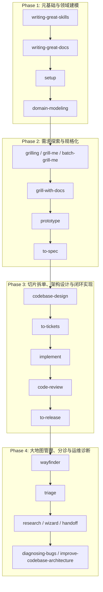

对于 Mermaid 语法造成的错误深感抱歉！Mermaid 引擎不允许用引号字符串作为节点直接连接箭头，箭头必须连接节点 ID。

下面是修复后的语法完全兼容版 Mermaid 流程图：

---

### 阶段流转关键节点汇总

1. **Phase 1 $\rightarrow$ Phase 2 衔接**：在完成 `domain-modeling` 建立上下文词汇表与 ADR 后，进入 Phase 2 的 `grilling` 需求盘问。
2. **Phase 2 $\rightarrow$ Phase 3 衔接**：在 `to-spec` 完成需求规格化与 BDD 验收试卷后，进入 Phase 3 的 `codebase-design` 六边形架构设计与 `to-tickets` 拆单。
3. **Phase 3 $\rightarrow$ Phase 4 衔接**：在 `to-release` 完成版本合并发布后，进入 Phase 4 的大地图维护 `wayfinder` 与日常运维诊断。