# Keel — 系统设计文档

> Keel 是一套 skill 驱动的 AI 自动化开发系统，深度集成 GitHub。人类仅在四个关卡介入，其余全部由 AI 接管。核心思想：契约先行、对抗隔离、双循环 TDD、skill 驱动。

---

## 一、系统架构

### 1.1 组件总览

Keel 由五个组件构成，分布在三个运行环境中。

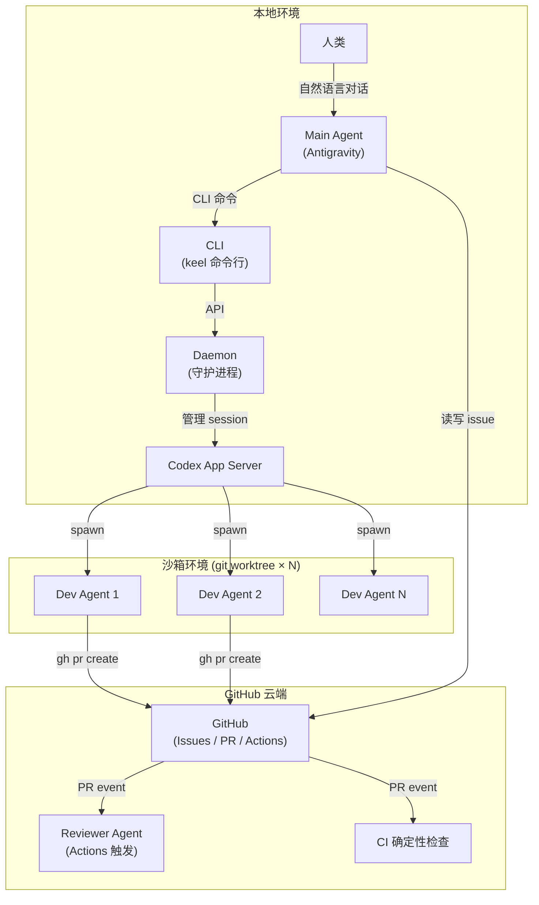

### 1.2 组件职责

**Main Agent**（本地 · Antigravity 对话线程）

Main Agent 是整个系统的大脑。运行在用户对话线程中，消费 orchestration skill，扮演三个角色：

- **Architect 角色**：定义结构契约（接口、.proto），划定架构边界，产出 ADR。
- **QA 角色**：编写行为契约（.feature 场景、步骤断言），定义验收标准。
- **PM 角色**：与人类协作完成需求澄清、方案选择、计划确认。

Main Agent 不直接写实现代码。它通过 CLI 调度 Daemon 派发开发任务，通过 GitHub API 管理 issue 和 PR。

**CLI**（本地 · 命令行工具）

Main Agent 向 Daemon 发命令的唯一接口。人类不直接使用 CLI——人类通过自然语言与 Main Agent 对话，Main Agent 决定何时调用什么命令。

```bash
keel spawn  --issue=<id> --model=<model> --thinking=<level>  # 创建 task，启动 Dev Agent
keel query  [--id=<id>] [--issue=<id>] [--status=<status>]   # 查询 task 状态
keel list                                                     # 列出所有活跃 task
keel kill   <id>                                              # 终止 task，清理 worktree
keel reuse  <id> --prompt="..."                               # 复用已有 session，追加指令
keel search <keyword>                                         # 搜索 task 历史
```

**Daemon**（本地 · 守护进程）

Daemon 是 Codex App Server 的薄封装，核心职责是将 issue、git worktree 和 Codex session 绑定为 **task**——系统的最小可管理单元。

Daemon 的边界非常清晰：

- ✅ 接收 CLI 命令，创建 git worktree，启动 Codex session
- ✅ 监控 agent 进程存活状态（heartbeat / 退出码）
- ✅ 管理 Codex session（复用已有 session vs 新建）
- ✅ 维护 task 状态机
- ❌ 不含工作流逻辑（归 skill）
- ❌ 不含 AI 推理能力（不能写 PR body、不能理解 issue 语义）
- ❌ 不管 Reviewer Agent（归 GitHub Actions）
- ❌ 不决定何时派发（归 Main Agent）

**Dev Agent**（沙箱 · Codex 进程）

由 Daemon spawn 到独立 git worktree 中的 AI agent。每个 Dev Agent 对应一个 task，独立开发一个切片。Dev Agent 消费 execution skill，执行双循环 TDD，完成后自行通过 `gh pr create` 提交 PR（包括撰写 PR body）。

Dev Agent 的硬约束：

- 不得修改 `.feature` 文件与步骤断言（`Then` 判定逻辑）
- 不得修改 `.proto` 文件与结构契约
- 不得修改 CODEOWNERS 保护的任何契约文件
- 任一时刻只推进一个失败测试（一次一个 RED）

**Reviewer Agent**（云端 · GitHub Actions）

由 GitHub Actions 在 PR 事件触发的云端 AI。执行双轴评审，与 CI 确定性检查并行运行。不受 Daemon 管理，不消耗本地资源。

---

## 二、Task 生命周期

Task 是 Daemon 管理的核心抽象，绑定三个资源：

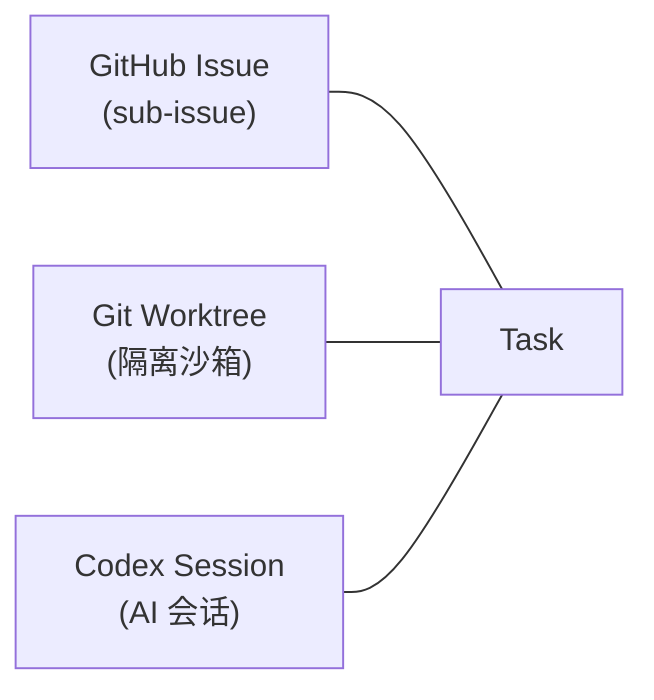

### 2.1 状态机

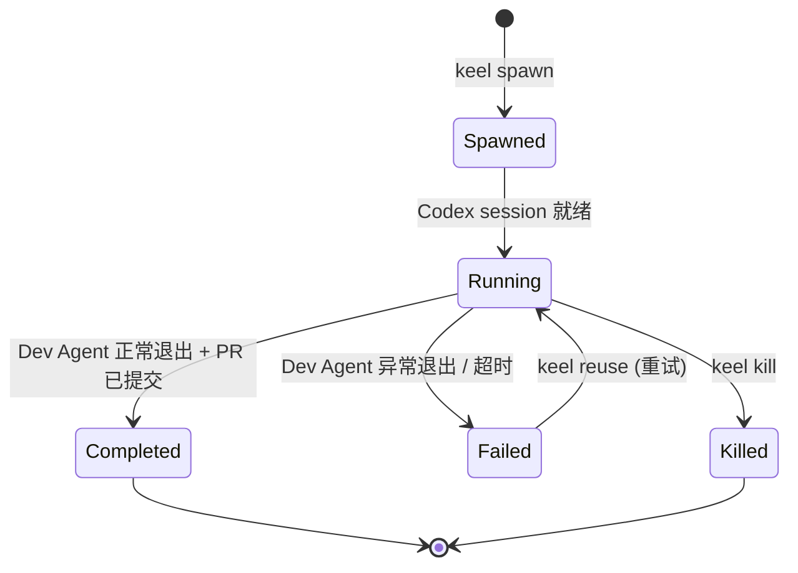

### 2.2 资源管理

| 事件 | Worktree | Codex Session |
|---|---|---|
| `spawn` | 从主分支创建 | 新建 |
| `reuse` | 保留 | 复用已有 |
| `kill` | 清理删除 | 终止 |
| `completed` | 保留至 PR 合并后清理 | 终止 |
| `failed` | 保留（供诊断） | 保留（供 reuse） |

---

## 三、Skill 系统

### 3.1 两层架构

Skill 是声明式工作流指令文件，被 AI agent 消费。按消费者分两层，物理隔离在不同目录。

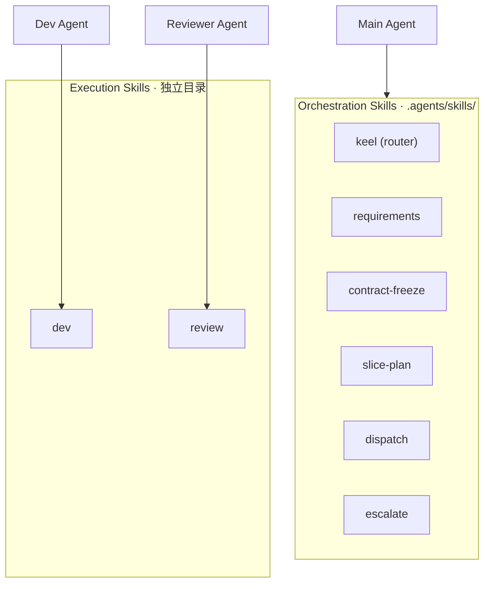

**隔离理由**：Orchestration skill 在 `.agents/skills/` 目录下，被 Antigravity 运行时加载。Execution skill 放独立目录，避免其 description 污染 Antigravity 的上下文窗口。Execution skill 随仓库代码版本走，Dev Agent 在 worktree 中直接读取。

### 3.2 Orchestration Skills（Main Agent 消费）

#### `keel`（Router）

全流程路由器。Main Agent 不确定该用哪个 skill 时的入口。映射从需求到交付的完整路径，指向各阶段 skill。

#### `requirements`（关卡 1–2）

Leading word: **clarify**。

烤问产品意图，消除歧义，确定技术方案。产出：refined GitHub issue（产品级 BDD 验收意图 + ADR）。组合 `grilling` + `domain-modeling` 原语。

#### `contract-freeze`（关卡 3）

Leading word: **freeze**。

冻结 L1 稳定产物——结构契约（接口 / .proto）与行为契约（产品级 .feature）。产出：独立 PR 合并后的冻结契约。冻结后的契约成为 Dev Agent 的硬边界，不可漂移。

#### `slice-plan`

Leading word: **slice**。

将 parent-issue 拆分为 sub-issue DAG。每个 sub-issue 绑定 .feature 场景引用、依赖声明、切片级完成定义。产出：一组就绪的 sub-issue，每个 sub-issue 都可独立 `keel spawn`。

#### `dispatch`

Leading word: **dispatch**。

通过 CLI 调度 Daemon 派发 task。核心动作：检查依赖就绪 → `keel spawn` → 监控并行 task 状态 → 处理完成 / 失败。Main Agent 可在对话中随时 `keel query` / `keel list` 向人类汇报进展。

#### `escalate`

Leading word: **escalate**。

关卡 4 的确定性触发器。不依赖 AI 推理判断——以可观测的条件自动停手并升级人类：

- 同一 RED 连续 N 次未转 GREEN
- Dev Agent 试图修改契约文件
- 覆盖率或变异分数低于阈值
- 契约歧义或切片间冲突
- 同一提交重跑 M 次结果不稳定（flaky test）

### 3.3 Execution Skills（Dev Agent / Reviewer Agent 消费）

#### `dev`

Leading word: **dual-loop**。

Dev Agent 被 spawn 后的全流程指令。严格的双循环 TDD：

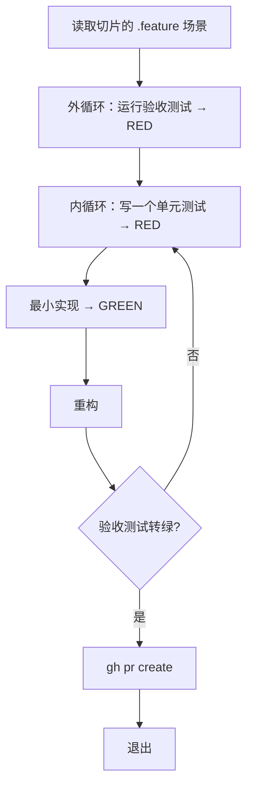

硬约束写在 skill 中：不修改契约文件、一次一个 RED、PR body 必须引用 issue。

#### `review`

Leading word: **dual-axis**。

Reviewer Agent 在 PR 事件触发后执行的双轴评审：

| 轴 | 问题 | 方法 |
|---|---|---|
| **规格轴** | 实现是否忠实满足验收意图？ | 比对 .feature 场景与代码行为，检查硬编码骗测 / 空断言 |
| **标准轴** | 是否符合 L1 架构标准？ | 比对 ADR / 接口契约 / 编码规范 |

反作弊检查与变异测试互补——规格轴负责捕捉逻辑层面的欺骗，变异测试负责捕捉断言层面的空洞。

### 3.4 Shared Reference

Skill 通过 context pointer 按需引用 `docs/architecture/` 下的参考文档。这些文档不是 skill，不含步骤指令，只在被引用时进入 agent 上下文。

| 文档 | 内容 |
|---|---|
| `contract-conventions.md` | 四种冻结策略（设计先行 / 骨架先行 / 双层冻结 / 按需冻结）、四种演进策略（直接改 / 只增不改 / 平行变更 / 版本化共存）、契约状态表达（.proto deprecated / .feature @wip / schema 迁移） |
| `testing-conventions.md` | 测试金字塔与分层归属、BDD 执行（Gherkin + cucumber-rs）、覆盖率与变异测试互补关系、视觉测试成本控制、性能基准 |
| `github-conventions.md` | Issue 层级（parent-issue / sub-issue）、依赖调度（偏序 DAG + 就绪规则）、CODEOWNERS 配置、分支保护与合并门禁、CI/CD 流水线 |

---

## 四、工作流全景

### 4.1 端到端流程

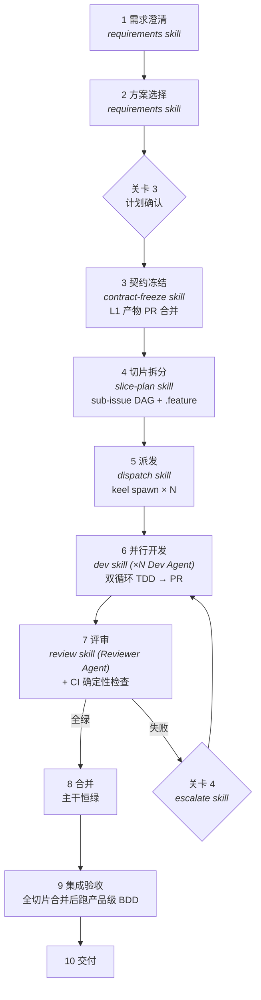

### 4.2 关卡详述

| 关卡 | 触发 | 人类决策 | 产出 |
|---|---|---|---|
| **关卡 1 需求澄清** | 新 issue / 需求模糊 | 确认产品意图 | Refined issue + BDD 验收意图 |
| **关卡 2 方案选择** | 存在多个技术路径 | 选择技术方案 | ADR |
| **关卡 3 计划确认** | 方案确定后 | 冻结 L1 契约 + 切片骨架 | 冻结的 .proto / .feature + sub-issue DAG |
| **关卡 4 缺陷升级** | 确定性条件触发 | 决定修复 / 放弃 / 调整契约 | 修正后的 issue 或契约变更 |

> **关卡 3 是唯一的强控制点**。冻结后的契约是 Dev Agent 的执行约定——照做即可、无需设计。QA（Main Agent）在此之后仅将切片细化为 .feature 场景，不重新决定架构边界。

### 4.3 并行模型

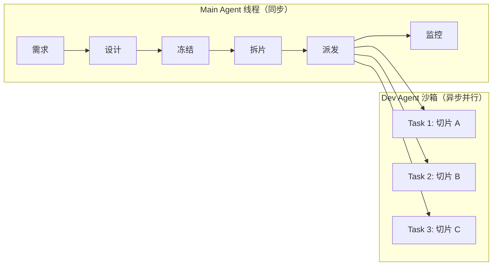

- 并行只发生在 **agent 之间**（各自独立切片、各自 worktree），不发生在单个 agent 内部。
- Main Agent 派发后**不阻塞等待**——Daemon 异步管理 task，Main Agent 可继续与人类对话或处理其他 issue。
- 依赖以偏序 DAG 声明。就绪的切片可并行派发，有依赖的切片等前置完成后再派发。

---

## 五、契约体系

### 5.1 产物分层

所有产物按耐久度分三层。层级由架构边界客观决定，不是临场判断。

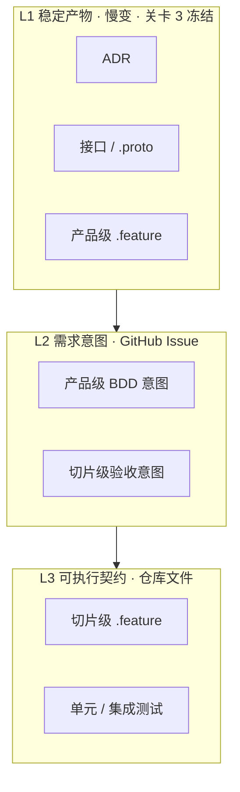

| 层 | 载体 | 变化速度 | 由谁写 |
|---|---|---|---|
| L1 稳定产物 | 仓库文档 / .proto / 产品级 .feature | 慢 | Main Agent (Architect / QA 角色) |
| L2 需求意图 | GitHub issue | 每个功能 | Main Agent (PM 角色) + 人类 |
| L3 可执行契约 | 仓库 .feature / 测试代码 | 每个切片 | Main Agent (QA) 写 .feature；Dev Agent 写测试 |

### 5.2 谁定与何时定

| 契约类型 | 由谁定 | 何时冻结 |
|---|---|---|
| 结构契约（接口 / .proto） | Main Agent · Architect 角色 | 关卡 3，独立 PR |
| 行为契约（.feature 场景 + 步骤断言） | Main Agent · QA 角色 | 关卡 3（产品级）/ 切片细化时（切片级） |
| 单元测试 | Dev Agent | 内循环即时写 |

> **反模式**：Dev Agent 在编码过程中自行发明契约。契约必须由独立权威在实现前给出。

### 5.3 对抗隔离落地

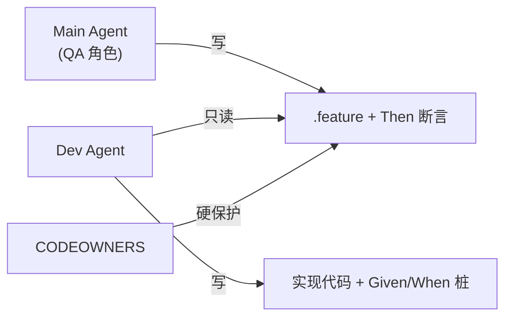

- `features/` 与 `proto/` 在 CODEOWNERS 中指定属主为 Architect / QA。
- Dev Agent 的 PR 一旦触及这些路径 → CI 自动标记违规 → 关卡 4 升级。
- 这是 GitHub 层面的机械式保护，不依赖 agent 自律。

---

## 六、GitHub 集成

### 6.1 Issue 结构

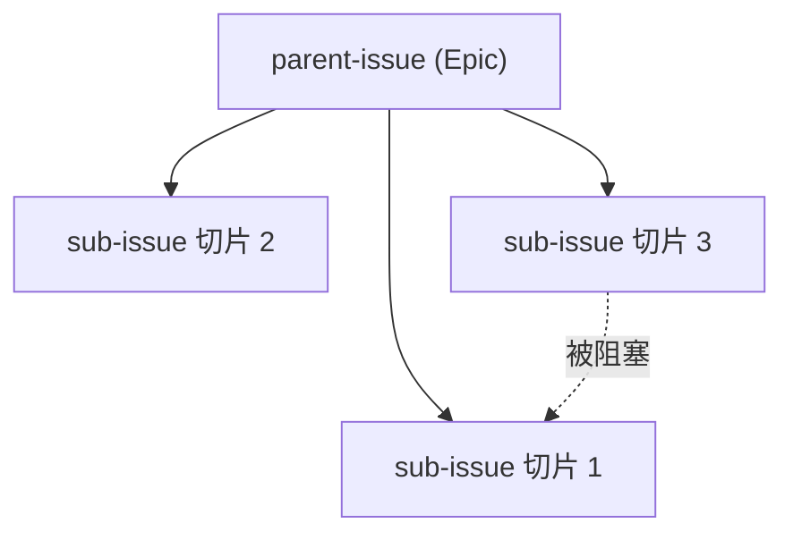

**parent-issue 包含**：
- 产品级 BDD 验收意图（人类 + Main Agent 在关卡 1–2 确认）
- 关联的 L1 产物链接
- 拆分骨架

**sub-issue 包含**：
- .feature 文件路径 + 场景名的**引用**（不放自然语言副本）
- 依赖声明（blocked-by）
- 切片级完成定义

### 6.2 PR 流程

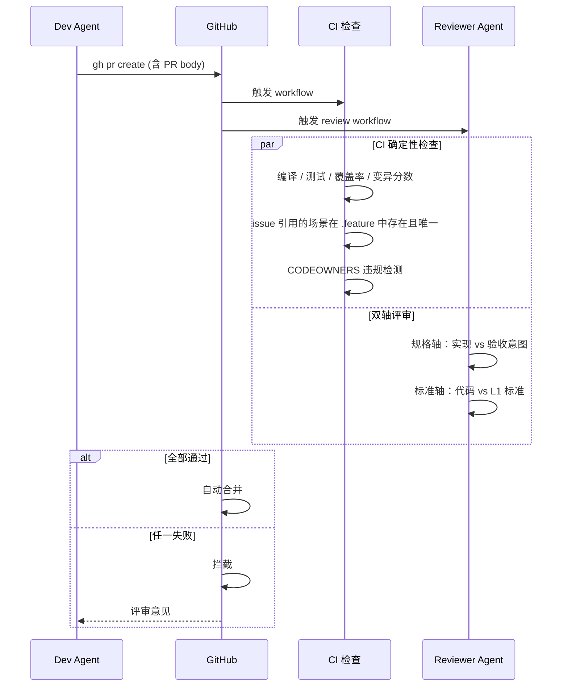

### 6.3 GitHub 原生能力映射

| 需求 | GitHub 能力 |
|---|---|
| Parent / sub-issue 层级 | 原生 sub-issues |
| 依赖声明 | Issue blocked-by 关系 |
| 契约保护 + 强制评审 | CODEOWNERS + 分支保护 |
| 合并门禁 | 必需状态检查 + 要求分支保持最新 |
| Reviewer Agent 触发 | Actions `pull_request` 事件 |
| CI 确定性检查 | Actions workflow |

---

## 七、质量门禁

### 7.1 CI 确定性检查（不需推理）

| 检查项 | 方法 |
|---|---|
| 编译通过 | `cargo build` |
| 全部测试通过 | `cargo test`（含 cucumber-rs） |
| 增量覆盖率达标 | `cargo-llvm-cov`，卡新增代码 |
| 变异分数达标 | `cargo-mutants`，仅改动集 |
| Issue 引用有效 | 脚本检查：引用的 `path::scenario` 在 .feature 中存在且唯一 |
| 契约文件未被 Dev Agent 修改 | CODEOWNERS 自动阻断 |

### 7.2 Reviewer Agent 评审（需推理）

| 轴 | 检查内容 |
|---|---|
| 规格轴 | 实现是否忠实满足 .feature 验收意图。反作弊：检查硬编码骗测、空断言 |
| 标准轴 | 是否符合 ADR、架构约束、编码规范 |

### 7.3 升级触发（确定性条件）

| 条件 | 升级到 |
|---|---|
| 同一 RED 连续 N 次未转 GREEN | 关卡 4 |
| Dev Agent 试图修改契约文件 | 关卡 4 |
| 覆盖率 / 变异分数低于阈值且无法自行补齐 | 关卡 4 |
| 契约存在歧义或切片间冲突 | 关卡 1 |
| 同一提交重跑 M 次结果不稳定 | 隔离为 flaky test，升级 |

---

## 八、仓库布局

```
repo/
├── .agents/
│   └── skills/              # Orchestration Skills (Main Agent)
│       ├── keel/
│       ├── requirements/
│       ├── contract-freeze/
│       ├── slice-plan/
│       ├── dispatch/
│       └── escalate/
├── .keel/
│   └── skills/              # Execution Skills (Dev Agent / Reviewer Agent)
│       ├── dev/
│       └── review/
├── docs/
│   ├── architecture/
│   │   ├── adr/             # 架构决策记录
│   │   ├── design.md        # 本文档
│   │   ├── contract-conventions.md
│   │   ├── testing-conventions.md
│   │   └── github-conventions.md
│   ├── product/
│   │   ├── vision.md
│   │   └── nfr.md
│   └── origin/              # 原始参考文档存档
├── proto/                   # 结构契约 (.proto)
├── features/                # BDD .feature (产品级 + 切片级)
├── migrations/              # 数据库 schema 迁移脚本
├── crates/
│   └── <service>/
│       ├── src/
│       └── tests/
├── .github/
│   ├── CODEOWNERS
│   └── workflows/
│       ├── ci.yml           # 编译 / 测试 / 覆盖率 / 变异
│       └── review.yml       # Reviewer Agent 触发
├── CONTEXT.md               # 领域术语表
└── README.md
```
