# GitHub × 全 AI 团队自动化开发工作流设计

> 本文档定义一套面向 **全 AI 开发团队** 的自动化开发工作流：QA 与 Developer 均为 AI 智能体，开发全程由 AI 接管，人类仅在四个关卡介入。整体以契约先行、垂直切片、双循环 TDD 为骨架，并深度集成 GitHub。

## 一、设计目标与核心原则

需求由 GitHub issue 承载，稳定设计沉淀在仓库，实现由 AI 智能体基于垂直切片自动完成。设计围绕以下原则展开。

1. **契约先于实现**：接口、数据结构、验收标准在实现开工前冻结，成为解耦边界。
2. **对抗隔离**：编写测试的智能体与编写实现的智能体分离，杜绝自我验证。
3. **单一事实源**：每份契约在仓库中只有一份权威副本，其余位置只引用，不复制。
4. **一次一个 RED**：任一智能体在任一时刻只推进一个失败测试；并行只发生在智能体之间，不发生在单个智能体内部。
5. **主干恒绿**：主分支任何时刻可编译、测试通过。
6. **确定性优先**：AI 推理只在必要处调用；可用确定性脚本判定的事，不依赖推理。

## 二、角色模型与人类关卡

| 角色 | 职责 | 产出 |
| --- | --- | --- |
| **Architect** | 定义结构契约与架构边界 | ADR、架构、接口、`.proto` |
| **QA** | 依据已冻结的产品意图编写可执行验收 | `.feature` 文件、验收场景、步骤断言（含 `Then` 判定逻辑） |
| **Developer** | 面向冻结的契约实现功能，不得修改契约 | 实现代码、内层单元测试 |
| **Reviewer** | 在 PR 上执行规格轴与标准轴的双轴评审 | 评审结论、批准 / 拦截 |
| **PM / 人类** | 把关四个关卡、定义产品级验收 | 产品级 BDD、关卡决策 |

人类的介入被压缩为四个关卡，其余全部由 AI 自动接管。

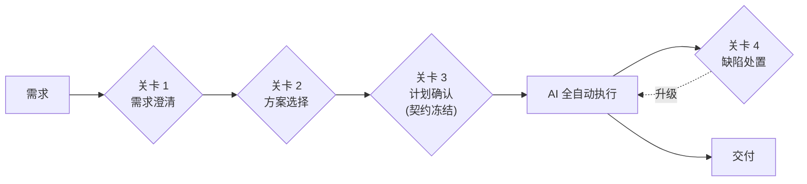

> **关卡 3（计划确认）是唯一的强控制点**：人类在此冻结 L1 契约与顶层拆分骨架。冻结后的契约即成为 AI 执行的约定，AI 不得擅自漂移。QA 随后仅把切片细化为 `.feature` 场景，不重新决定拆分边界。

## 三、产物分层

一切内容按耐久度与耦合机制分为三层。分层不是按 issue 现场判断，而是由架构边界客观决定。

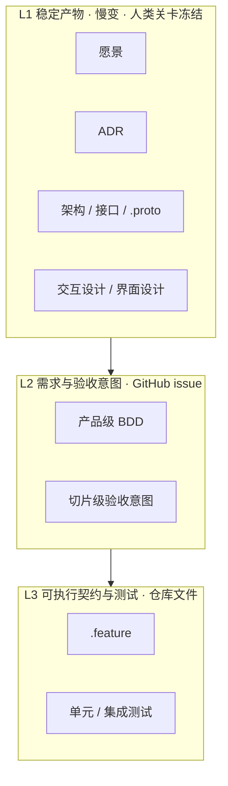

| 层 | 载体 | 变化速度 | 对应评审轴 |
| --- | --- | --- | --- |
| L1 稳定产物 | 仓库文档 / `.proto` / 产品级 `.feature` | 慢 | **标准轴** |
| L2 需求意图 | GitHub issue | 每个功能 | **规格轴** 的来源 |
| L3 可执行契约 | 仓库 `.feature` / 测试 | 每个切片 | **规格轴** 的执行体 |

> 结构契约（`.proto`、接口）与产品级 `.feature` 坐落在模块边界上，属于 L1 稳定产物，走独立 PR 冻结；切片级 `.feature` 随切片增量落地。判定共享或局部的标准是客观的：契约位于两个组件的边界上即为共享。

> 区分三种 BDD 载体：**产品级 BDD 意图**（L2，issue 内自然语言）、**产品级 `.feature`**（L1，可执行、边界级、独立 PR 冻结）、**切片级 `.feature`**（L3，随切片增量落地）。

## 四、契约先行开发

### 4.1 两个正交问题：谁定与何时定

| 问题 | 答案 |
| --- | --- |
| **谁定契约** | Architect（结构）/ QA（行为）。**Developer 从不编写、也不提取契约。** |
| **何时冻结契约** | 在实现开工前。可提前全量冻结，也可逐切片冻结——见 4.2。 |

> **反模式**：Developer 在编码过程中自行发明契约，会导致漂移与自我验证。契约必须由独立权威在实现前给出。

### 4.2 四种冻结策略（一条连续谱）

唯一的决策是「开工前冻结多少契约」。

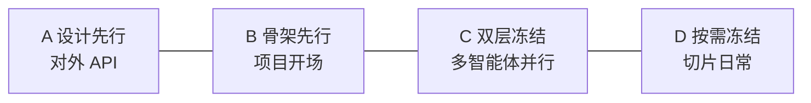

| 策略 | 开工前冻结 | 适用 |
| --- | --- | --- |
| **A 设计先行** | 整份契约 | 成熟领域、对外发布 API |
| **B 骨架先行** | 顶层接口 + 端到端主干 | 项目开场，先打通架构 |
| **C 双层冻结** | 共享边界冻结，局部逐切片定 | 多智能体并行的务实默认 |
| **D 按需冻结** | 仅当前切片所需 | 探索性、单智能体 |

> **推荐组合**：用 **B** 起步打通骨架 → 用 **C** 冻结共享边界以支撑并行 → 用 **D** 作为每个切片的日常 → 仅对外契约用 **A** 全量版本化。既给 Developer 硬边界（照做即可、无需设计），又避免过度规格化。

### 4.3 支撑机制：为何契约先行不会阻塞编译

契约是「可独立编译的声明」，不是实现。任意子集都能编译。

- 契约 = 接口 / 签名 / 数据结构 → 自身即可编译。
- 未实现处挂桩（`todo!()`）→ 编译通过，运行到才 panic。
- 依赖处用模拟 → 切片无需其他切片的真实实现即可独立编译与测试。
- 接缝由**消费者驱动契约测试**验证：同一份契约测试套件同时跑在模拟与真实实现上，二者必须同时通过；对 `.proto` 的 RPC 可从契约生成一致性测试。此项为 L3 强制项，防止模拟与真实实现随时间漂移。

> **结构契约与行为契约同构**：`.proto` 生成的接口 / trait 的 `todo!()` 桩 ≡ `.feature` 的 RED 场景——都是「契约已声明、桩可编译 / 可运行但未满足」的合法中间态。二者共享同一套实践：声明先行、模拟隔离、增量兑现、接缝测试。

## 五、垂直切片与双循环 TDD

每个切片是一条穿透所有层的最小端到端行为。切片内部严格执行双循环 TDD。

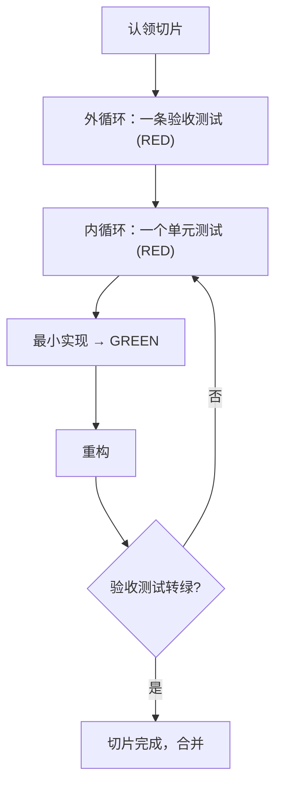

| 循环 | 粒度 | 归属 |
| --- | --- | --- |
| 外循环 | 一条验收测试（`.feature` 场景） | QA 编写并冻结 |
| 内循环 | 一次一个单元测试 | Developer 编写实现与单元测试 |

> **并行的边界**：并行只发生在**智能体之间**（各自独立切片、各自 `git worktree`），不发生在单个智能体内部。「一次一个 RED」仅约束内循环；外循环的验收测试标 `@wip`，作为北极星目标贯穿整个切片但不计入活跃 RED。单个 Developer 任何时刻只保持一个内层 RED，堆积多个内层 RED 是反模式。

## 六、GitHub 结构映射

### 6.1 issue 层级

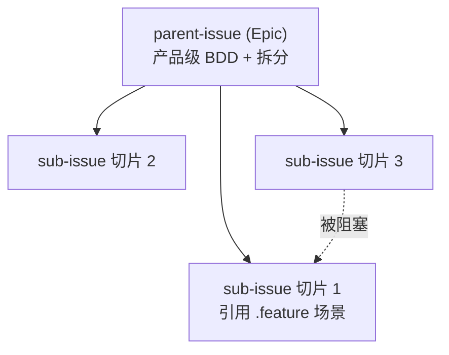

| 载体 | 内容 |
| --- | --- |
| **parent-issue** | 产品级 BDD 验收意图（人类冻结）、关联的 L1 稳定产物链接、拆分骨架、功能级完成定义 |
| **sub-issue** | 切片范围、对 `.feature` 文件与场景的**引用**、适用的 L1 约束、切片级完成定义、依赖声明 |

> sub-issue **只引用** `.feature` 文件（路径 + 场景名），**不放第二份自然语言副本**。以此保证单一事实源，CI 无需推理即可判定一致性。

### 6.2 依赖调度

依赖以显式边声明（sub-issue 父子关系 + 被阻塞），构成偏序 DAG，而非全序。

- **就绪规则**：一个 sub-issue 的依赖全部合并后，它才就绪。
- **并行**：就绪的切片可被多个智能体并行认领。
- **新增 issue**：只声明其直接依赖，无需扫描全部未实现 issue。

### 6.3 沙箱隔离

每个被认领的切片分配独立 **`git worktree`**，一个工作树承载一次切片开发，完成后提 PR。触发单位是「一个被指派的任务」，而非「一次文件编辑」。

### 6.4 合并冲突处理

双层冻结能降低但不能消除合并冲突。处理遵循固定流程：

- **文本冲突**：将变基作为一个新任务派给一个 Developer，解决后必须重跑该切片全部测试 + 受影响的集成测试。
- **语义冲突**（各自 GREEN 但合并后行为不一致）：由 Reviewer 的规格轴兜底捕捉，必要时升级。
- 冲突解决后的分支须重新满足 CI 全绿 + 双轴评审方可合并。

## 七、契约与测试的载体

> `.feature` 与 `.proto` **都是仓库文件**，都走 PR 评审，都是单一事实源。issue 只引用它们。

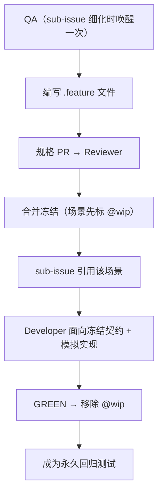

### 契约状态的表达

状态用**文件内标记 / 版本化**表达，不用目录拆分。

| 契约 | 状态表达方式 |
| --- | --- |
| `.proto` | `[deprecated = true]` 标记弃用；以 `reserved` 保留移除字段的编号（永不复用）；主版本用独立包（如 `v1` / `v2`） |
| `.feature` | 未实现场景标 `@wip`；CI 以 `not @wip` 过滤，将其排除在必绿之外 |
| schema / 数据 | 以版本化迁移脚本表达演进；破坏性变更按扩展-收缩拆分，旧结构在收缩前保留兼容期（见 9.3） |

### 唤醒成本

- **QA** 每个 sub-issue 唤醒一次（细化阶段编写 `.feature` 文件），认领开发时**不再**唤醒。
- **Architect** 仅在需要新增 / 变更结构契约时唤醒，绝大多数切片不触发。
- sub-issue 即该切片的**完整**测试计划；全产品测试计划 = 所有 sub-issue 之和 + 集成级验收。

## 八、双轴评审与质量门禁

每个 PR 经过 CI 确定性检查与 Reviewer 的双轴评审。

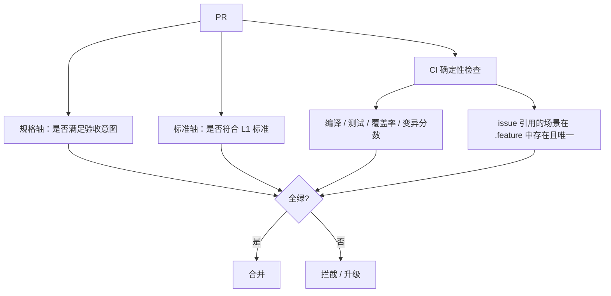

| 检查项 | 是否需推理 | 执行者 |
| --- | --- | --- |
| 引用有效性：issue 引用的 `path::scenario` 在 `.feature` 中存在且唯一 | 否 | CI |
| 编译、测试、覆盖率、变异分数 | 否 | CI |
| 实现是否忠实满足验收（规格轴，反作弊：防硬编码骗测 / 掉空断言，与变异测试互补） | 是 | Reviewer |
| 是否符合架构 / 标准（标准轴） | 是 | Reviewer |

**质量门禁要点**：CI 是 AI 团队的管理者，必须比人类团队更强硬。

- **对抗隔离**：Developer 不得修改验收测试，越界即标记并升级。
- **变异测试**：注入变异以捕捉空断言的弱测试。
- **确定性**：禁用真实网络、固定随机种子、封闭环境，保证可复现。
- **快速失败**：低成本检查前置，尽早拦截。

### 8.1 升级策略

AI 必须在以下**可确定性判定**的条件下停手并升级人类，避免空转或无声漂移：

- 同一 RED 连续 N 次尝试仍未转 GREEN（疑似卡死）→ 关卡 4。
- 检测到 Developer 试图修改验收测试或步骤断言 → 关卡 4。
- 契约存在歧义、或切片间契约冲突 → 关卡 1（需求澄清）。
- 覆盖率或变异分数低于阈值且无法自行补齐 → 关卡 4。
- 不稳定测试与真失败区分：同一提交重跑 M 次结果不稳定判为不稳定测试，隔离观察并升级，不计入主干失败。

## 九、契约演进

### 9.1 总开关：契约是否激活

> **激活 = 已有「已实现的消费者」依赖它**。这一个状态把演进复杂度一分为二：未激活可随意改；已激活须安全迁移。

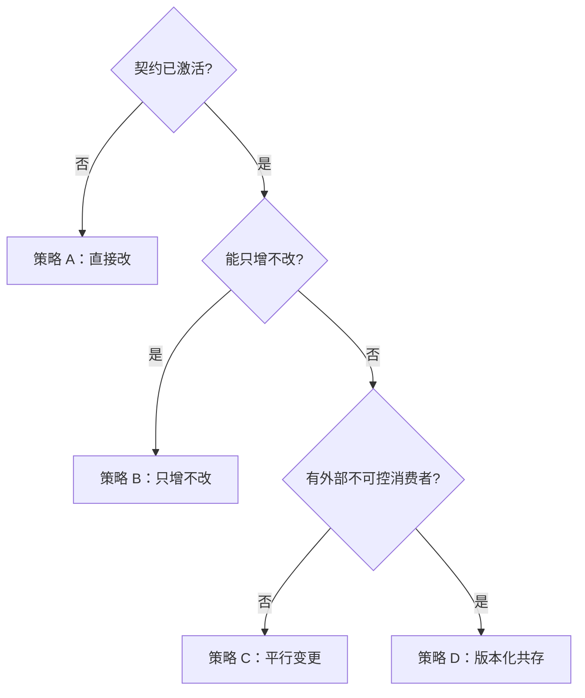

### 9.2 四种演进策略

| 策略 | 触发条件 | 做法 |
| --- | --- | --- |
| **A 直接改** | 未激活 | 直接改契约 + 更新引用它的未实现 issue，重新评审 |
| **B 只增不改** | 已激活 + 兼容新增 | 加新字段 / 新场景，旧消费者零影响 |
| **C 平行变更** | 已激活 + 内部可控 | 新旧并存 → 逐消费者迁移 → 删旧（`reserved` 保留编号） |
| **D 版本化共存** | 已激活 + 外部消费者 | 保留旧版本 + 弃用周期，新版本并行，永不强断 |

> **心法**：永远把破坏性修改转化为「新增 → 迁移 → 删除」的一串兼容步骤。`.proto`（编译期硬耦合）必须严格执行平行变更；`.feature`（测试期软耦合）以新切片走分支 + 双循环等价实现。变更成本 ∝ 已实现消费者数量，故未实现的依赖改动极廉价。

### 9.3 数据与状态迁移契约

数据库 schema 与持久化数据结构同样是契约。一旦存在已写入的生产数据，它便「已激活」，其演进必须遵循与 `.proto` 同级的安全迁移纪律。

- **迁移即契约**：schema 变更以版本化迁移脚本表达，纳入仓库、走 PR 评审、与代码同源演进，构成 schema 的单一事实源。
- **扩展-收缩（expand-contract）**：破坏性变更一律拆成「先扩展（新增兼容字段 / 表）→ 双写与回填 → 迁移读路径 → 收缩（删除旧结构）」的一串向后兼容步骤，任一相邻版本都能与前后版本的代码共存——这正是 9.2「平行变更」在数据层的落地。
- **兼容方向**：迁移的每一步都须保证「旧代码 + 新 schema」或「新代码 + 旧 schema」至少一个方向可运行，从而支撑滚动发布与回滚。
- **迁移测试**：迁移脚本自身可测——在接近生产的数据快照上验证正向可迁移、可回滚，且迁移前后关键不变量成立。

## 十、测试体系

### 10.1 测试金字塔

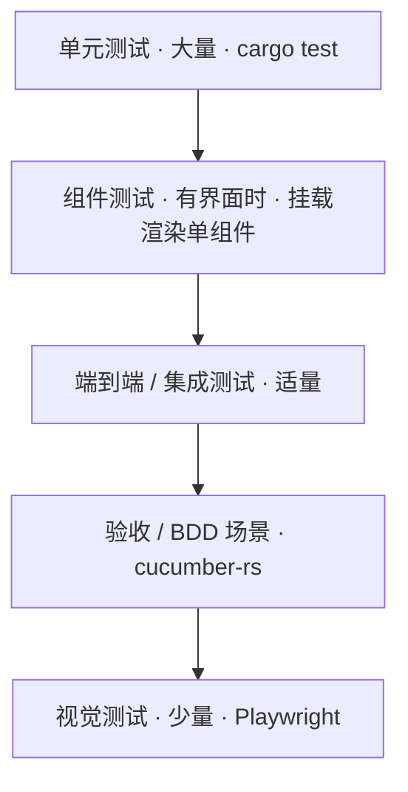

| 类型 | 手段 | 产出可读性 |
| --- | --- | --- |
| 单元 / 集成 / 无界面端到端 | `cargo test`（CI 并行） | 文本，AI 可直接读改 |
| 组件测试（有界面时） | `wasm-bindgen-test` / 组件挂载 | 文本，AI 可直接读改 |
| 结构快照 | `toMatchAriaSnapshot`（YAML 文本）/ `insta` | 文本，AI 友好，仅结构变化才失败 |
| 像素视觉 | `toHaveScreenshot`（像素比对） | 图像，失败时才调用视觉 AI |

### 10.2 视觉测试成本控制

> 像素比对在自有 CI 运行机上运行，无单张快照费用。每次运行免费做像素比对，**仅在失败时**调用视觉 AI 分析差异，从而控制成本。结构层优先用 `toMatchAriaSnapshot`，噪声更低。

### 10.3 基线生成

| 快照类型 | 基线生成位置 |
| --- | --- |
| 文本快照（`insta` / aria） | 本地生成可移植 |
| 像素截图 | **必须**在与 CI 一致的环境（容器）生成，避免渲染差异导致的误报 |

推荐做法：以手动触发的「更新基线」任务在 CI 环境生成截图 → 自动开 PR → 由 Reviewer 审图后合并；主干 CI 只做只读比对。

### 10.4 BDD 执行

- `.feature` 使用 Gherkin：`Feature` / `Scenario` 为结构，`Given` / `When` / `Then` / `And` / `But` 为步骤，每一步经正则 / 宏匹配一个步骤函数。
- 步骤函数是手写的胶水层，把 Gherkin 翻译为实际操作；骨架可生成，断言逻辑须编写。
- **归属边界**：`.feature` 场景与步骤断言（`Then` 判定逻辑）均属 QA 的冻结产物，Developer 只读；Developer 可写 `Given`/`When` 驱动桩，但不得改动断言。以 CODEOWNERS 对断言文件做强制评审保护（见第十三节）。
- **cucumber-rs** 从 `.feature` 出发按场景执行，默认场景级并发、各场景独立 `World`；支持标签过滤（如 `@wip`）。它仍由 `cargo test` 触发，只是以 `harness = false` + 自定义入口运行，不走标准测试库的 `#[test]` 自动发现。

> BDD 的价值：业务可读的可执行规格、步骤复用、活文档，并作为人类在关卡 3 确认计划的可读产物——而非节省代码。

### 10.5 测试有效性的度量：覆盖率与变异测试

覆盖率与变异测试回答两个不同的问题，互补而非替代：前者问「代码是否被执行」，后者问「代码被改坏时测试是否察觉」。

| 手段 | 回答的问题 | 固有局限 |
| --- | --- | --- |
| 覆盖率 | 生产代码是否被测试**执行**到 | 只证明「跑过」，不证明「验证过」——满覆盖仍可能零断言 |
| 变异测试 | 代码被篡改时测试是否**失败** | 存在等价变异（改动后行为不变），无法也不应被杀死 |

- **覆盖率是必要不充分的地板**：优先采用分支覆盖而非行覆盖；门禁重点卡「新增 / 改动代码」的增量覆盖，而非强求存量全仓达标。执行次数为 0 的行即「完全无测试」的确定性信号。
- **变异测试是断言强度的真门禁**：每个存活变异体都是一份「缺失测试」的精确定位（文件、行、被篡改的表达式）；据此反推能区分原版与变异版的输入与断言，即可补齐。
- **等价变异体**（改动后行为不变者）无法也不应被杀死，须由 Reviewer 判定并标注忽略，防止为凑分数而滥标。
- **成本控制**：变异测试对每个变异体重跑测试，开销大；按「仅改动集 + 核心模块」运行，避免每次全仓全跑。
- **分层归属**：两者的主力应落在金字塔底部的单元测试；集成与验收层负责接缝与端到端，不以其堆高覆盖率。

### 10.6 组件测试

存在用户界面时，在单元与集成之间补一层组件测试：将单个组件独立挂载渲染，喂入 props / 状态、模拟交互，断言其渲染输出与行为，而不启动整个应用或走真实路由。

- **定位**：比单元测试更真实（真正渲染并处理交互），比端到端更快更稳（范围限于单个组件、隔离外部依赖）。
- **价值**：把界面层的绝大多数回归拦截在组件粒度，端到端仅保留关键用户流程，规避全页 E2E 的脆性与高开销。
- **工具**：Rust / WASM 前端（Leptos、Dioxus、Yew）以 `wasm-bindgen-test` 在无头浏览器挂载组件；纯逻辑仍走 `cargo test`。
- **归属**：属 Developer 内循环产物，与单元测试同轴，不触碰 QA 冻结的验收断言。

### 10.7 可访问性测试

可访问性（a11y）验证界面对键盘操作、屏幕阅读器等辅助技术可用，是界面层的横切检查。

- **语义优先**：以无障碍树断言替代脆弱的 DOM 选择器；结构快照优先采用无障碍树快照（如 `toMatchAriaSnapshot`），天然覆盖可访问性结构。
- **规则扫描**：以自动化规则引擎（axe 系）在 CI 中扫描常见违规，机器可判定的部分归确定性门禁。
- **分工**：可机械判定的规则交 CI；主观可用性由人工 / Reviewer 兜底。

### 10.8 性能测试

性能属非功能性契约：延迟、吞吐、资源占用等指标应像行为契约一样被显式声明、冻结并纳入门禁。性能测试分两类，各司其职：

- **微基准（microbenchmark）**：度量单个函数 / 热点路径的执行时间与内存（Rust 侧如 `criterion`），在固定条件下运行以捕捉代码级回归。
- **负载 / 压力测试**：度量整个服务的吞吐与尾延迟（如 p99）、并发承载（如 k6、Locust），在独立预发环境按 SLA 验证系统级表现。
**持续基准（continuous benchmarking）——性能版的视觉基线**

与视觉测试同构：保留历史最优 / 上次结果作为基线，新结果与之比较，劣化超过阈值即报警或让流水线失败。

- **基线留存**：将基准结果持久化（如提交到专用分支或基准服务），随提交演进并可视化趋势。
- **阈值报错**：设定劣化阈值并开启失败即门禁（如 `benchmark-action/github-action-benchmark` 的 `alert-threshold` + `fail-on-alert`），劣化时在 PR 留言并按关卡 4 升级。
**降噪是性能门禁的第一难题**

共享 CI runner 的 CPU 抖动大，直接拿墙钟时间做硬门禁会频繁误报。按投入递增的缓解手段：

- **相对比较**：在同一次运行内对比 PR 分支 vs 基线分支，抵消机器差异，而非跨时间比绝对值。
- **统计阈值**：按运行间方差自动定阈值（如 Bencher），在抖动环境仍能稳定识别显著回归。
- **换测量维度**：以指令数 / 模拟测量替代墙钟（如 CodSpeed），大幅压低方差，适合细粒度门禁。
- **专用机器**：需要真实墙钟（尤其负载测试）时，使用自建 / 调优 runner；托管共享 runner 不适合承载 walltime 门禁。
**执行策略**

- **降频运行**：基准与负载测试比单测慢，不进主 PR 阻塞门禁；置于 nightly、发版前或按标签触发，必要时用分片并行缩短时长。
- **分层门禁**：PR 上以相对比较 + 留言做信息性反馈；阻塞性门禁放在降频运行 + 专用 runner / 统计阈值之上。关键接口的吞吐 / 尾延迟阈值一经冻结即为契约，超阈值按缺陷升级（关卡 4）；确定性要求同样适用——固定环境、隔离噪声、可复现。
- **前端性能**：对界面加载与交互指标做预算化检查（如 Lighthouse 类指标），同样可接入持续基准与阈值报错。

## 十一、CI/CD 交付

### 11.1 分支保护与合并

- 小团队优先「要求分支保持最新」而非重型合并队列；随规模增长再引入合并队列（先进先出、临时分支串行验证）。
- 所有合并须通过必需状态检查（CI 全绿）+ 必需评审（双轴）。

### 11.2 交付流水线

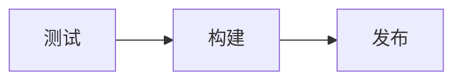

- 各阶段以 `needs` 串接：构建依赖测试，发布依赖构建——测试通过才构建，构建通过才发布。
- **可信发布**：使用 OIDC 短时令牌发布（无长期密钥），并附带来源证明。
- **版本管理**：以 Rust 原生的 `release-plz` / `cargo-release` 自动汇总变更、开「发布」PR，人类合并即触发发布，并与 crates.io 可信发布衔接。

### 11.3 发布后处置

主干恒绿只防合并前的问题，防不住已发布版本的线上缺陷。发布后须具备回滚能力：

- **回滚触发**：线上关键缺陷、指标劣化达阈值。
- **回滚动作**：回退发布提交并重新发版本；必要时对已发布版本执行 crates.io `yank`。
- **数据回滚**：已执行的 schema 迁移通常无法随代码一并回退；依赖扩展-收缩迁移（见 9.3）保证回滚后的代码仍兼容已迁移的 schema，避免不可逆的数据损坏。
- 回滚作为一次缺陷处置走**关卡 4**，修复后重走标准切片流程。

## 十二、端到端流程全景

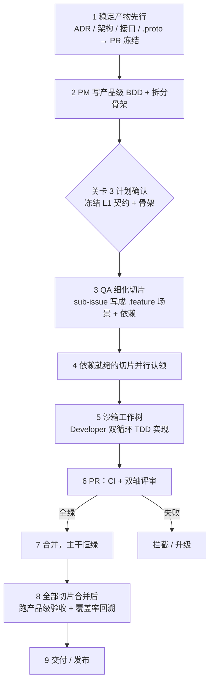

> **全景一句话**：稳定产物先行冻结为解耦地基 → 产品级 BDD 经人类确认 → QA 基于垂直切片拆片并编写可执行 `.feature` → 就绪的切片在沙箱工作树内由 Developer 双循环实现 → PR 双轴评审 → 合并保持主干恒绿 → 集成层验收后交付。契约始终先于实现、由独立权威冻结；并行在智能体间、纪律在智能体内。

## 十三、落地实现要点

### 13.1 仓库布局

```plain text
repo/
├─ docs/
│  ├─ adr/                 # 架构决策记录 (ADR)
│  ├─ vision/              # 愿景
│  └─ design/              # 交互设计 / 界面设计
├─ proto/                  # 结构契约 (.proto)
├─ features/               # BDD .feature（产品级 + 切片级）
├─ migrations/             # 数据库 schema 迁移脚本（版本化）
├─ crates/
│  └─ <service>/
│     ├─ src/
│     └─ tests/            # 单元 / 集成 / cucumber-rs
└─ .github/
   ├─ CODEOWNERS           # 保护契约文件
   └─ workflows/           # CI/CD 流水线
```

### 13.2 契约保护（对抗隔离的落地机制）

以 **CODEOWNERS** 将 `proto/`、`migrations/` 与 `features/`（含步骤断言）的属主指定为 Architect / QA。Developer 的 PR 一旦触及这些路径，就强制需要属主批准——在 GitHub 层面机械式地实现「Developer 不得修改契约」，而非依赖智能体自律。

### 13.3 工具链（Rust 栈）

| 能力 | 工具 |
| --- | --- |
| `.proto` 代码生成 / gRPC | `tonic`  • `prost` |
| BDD 执行 | `cucumber-rs` |
| 快照测试 | `insta` |
| 覆盖率 | `cargo-llvm-cov` |
| 变异测试 | `cargo-mutants` |
| 数据库迁移 | `sqlx migrate`  • `refinery` |
| 视觉测试 | Playwright（`toHaveScreenshot` / `toMatchAriaSnapshot`） |
| 组件测试 | `wasm-bindgen-test` |
| 可访问性 | `axe-core`（Playwright 集成） |
| 性能基准 | `criterion`  • 持续基准 `github-action-benchmark` / Bencher / CodSpeed |
| 发布 | `release-plz`  • crates.io 可信发布（OIDC） |
| 切片隔离 | `git worktree` |

### 13.4 GitHub 原生能力映射

| 需求 | GitHub 能力 |
| --- | --- |
| parent / sub-issue 层级 | 原生 sub-issues |
| 依赖声明 | issue 的被阻塞关系 / 任务清单 |
| 契约保护 + 强制评审 | CODEOWNERS + 分支保护（必需评审） |
| 合并门禁 | 必需状态检查 + 要求分支保持最新 |
| 智能体编排触发 | Actions 事件：`issues` / `issue_comment` / `pull_request` |

### 13.5 智能体编排

一个编排器（GitHub Actions 工作流或机器人）驱动整个循环：

1. 监听 issue 事件，选出依赖就绪的 sub-issue。
2. 为其创建 `git worktree`，拉起一个 Developer 智能体执行双循环 TDD。
3. 完成后开 PR，触发 CI 与 Reviewer 智能体。
4. CI 全绿 + 双轴批准后合并；否则按 8.1 升级。
5. 全部切片合并后跑集成级产品验收，触发发布流水线。

> **落地前提**：契约文件（`.proto` / `.feature`）与断言由 CODEOWNERS 硬保护；CI 全部封闭且确定性；模拟与真实实现由消费者驱动契约测试绑定；升级阈值（N / M / 覆盖率 / 变异分数）预先配置。具备这四项，本工作流即可落地。
