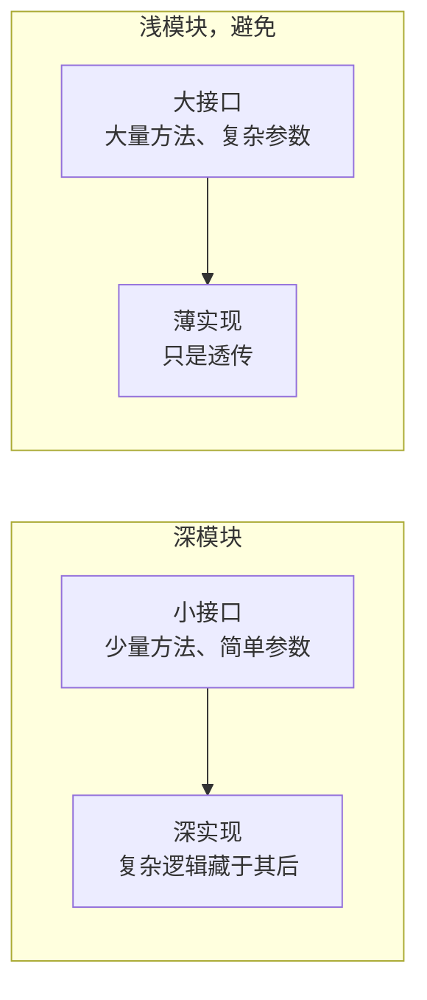

设计**深模块**：小接口背后承载大量行为，放在干净的接缝上，可通过接口测试。凡是设计或重构代码的地方都用这套语言和原则。

## 词汇表

精确使用这些词，不要用"组件""服务""API""边界"替代。用词一致是这套方法的核心。

**模块**：任何有接口和实现的东西，恰好一个接口。刻意与规模无关：函数、类、包、跨层切片都可以。避免: 单元、组件、服务

**接口**：调用方正确使用模块所需知道的一切：类型签名，以及不变式、顺序约束、错误模式、所需配置、性能特征。避免: API、签名

**实现**：模块内部的东西。与**适配器**区分：小适配器配大实现，比如 Postgres 仓储；大适配器配小实现，比如内存假件。讨论接缝时用"适配器"，其余用"实现"

**深度**：接口处的杠杆：调用方或测试每学习一单位接口能获得的行为量。大量行为藏在小接口后面是**深**，接口几乎和实现一样复杂是**浅**

**接缝**：不修改某处就能改变其行为的位置，即模块接口所在之处。接缝放哪里本身就是独立的设计决策，与接缝后面放什么不同。避免: 边界，它与 DDD 的限界上下文重载

**适配器**：在接缝处满足接口的具体东西。描述的是**角色**，填补哪个槽位，不是**实质**，里面是什么

**端口**：接缝处定义的接口，由适配器实现。跨接缝依赖场景中用它指代接口

**杠杆**：调用方从深度得到的东西：每学习一单位接口获得更多能力

**局部性**：维护方从深度得到的东西：变更、缺陷、知识、验证集中在一处，而不是散布在调用方之间

## 深与浅

**深模块** = 小接口 + 大量实现，**浅模块** = 大接口 + 薄实现，避免：



设计接口时问自己：

- 能减少方法数量吗？
- 能简化参数吗？
- 能把更多复杂度藏进内部吗？

## 原则

- **深度是接口的属性，不是实现的属性**。深模块内部可以由小的、可 mock 的、可替换的部分组成，它们只是不在接口里。模块可以有**内部接缝**，实现私有、自己的测试用，以及**外部接缝**，即接口处
- **删除测试**。想象删除这个模块：如果复杂度消失了，它是透传；如果复杂度在 N 个调用方重现，它物有所值
- **接口就是测试面**。调用方和测试穿过同一个接缝。如果测试想绕过接口，模块形状多半不对
- **一个适配器是假设的接缝，两个适配器才是真实的**。除非确实有东西跨接缝变化，不要引入接缝

## 为可测试性设计

好的接口让测试自然：

1. **接受依赖，不要创建依赖**

   ```typescript
   // 可测试
   function processOrder(order, paymentGateway) {}

   // 难测试
   function processOrder(order) {
     const gateway = new StripeGateway();
   }
   ```

2. **返回结果，不要制造副作用**

   ```typescript
   // 可测试
   function calculateDiscount(cart): Discount {}

   // 难测试
   function applyDiscount(cart): void {
     cart.total -= discount;
   }
   ```

3. **小表面积**：方法越少要写的测试越少，参数越少测试搭建越简单

## 拒绝的框架

- Ousterhout 把深度定义为实现行数对接口行数的比值，这奖励注水实现。我们用的是深度即杠杆
- 把"接口"理解为 TypeScript 的 interface 关键字或类的公共方法：太窄，接口在这里包含调用方需要知道的每个事实
- 用"边界"代替：它与 DDD 的限界上下文重载。说**接缝**或**接口**

## 深入

- **给定依赖深化模块集群**，见 [DEEPENING.md](./references/DEEPENING.md)：依赖分类、接缝纪律、替换而非叠加的测试
- **探索替代接口**，见 [DESIGN-IT-TWICE.md](./references/DESIGN-IT-TWICE.md)：并行子代理用截然不同的方式设计接口，再按深度、局部性、接缝位置比较
