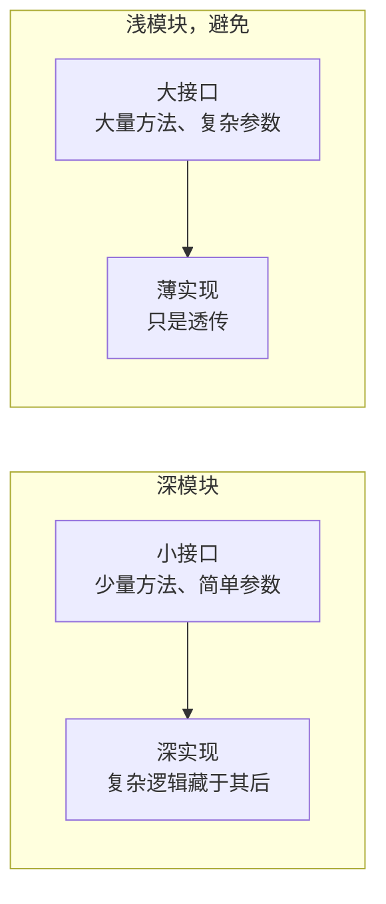

# 契约设计标准

to-spec 设计契约时的判断标准：接口的深浅、适配器与端口、依赖分类

## 词汇表

精确使用这些词，用词一致是这套方法的核心

- **模块**：有接口和实现的东西，恰好一个接口。与规模无关：函数、类、包、跨层切片都算。避免叫组件、服务

- **接口**：调用方正确使用模块所需知道的一切：类型签名、不变式、顺序约束、错误模式、所需配置、性能特征。避免叫 API、签名、边界（边界与 DDD 的限界上下文重载）

- **实现**：模块内部的东西

- **适配器**：在接口处提供实现的东西，描述的是角色（填补哪个槽位），不是实质。小适配器配大实现，如 Postgres 仓储；大适配器配小实现，如内存假件

- **端口**：由适配器实现的接口，跨进程依赖中用它指代接口

- **深度**：接口的杠杆：调用方或测试每学一单位接口，能获得的行为量。大量行为藏在小接口后面是深，接口几乎和实现一样复杂是浅

## 深与浅

深模块 = 小接口 + 大量实现；浅模块 = 大接口 + 薄实现，避免：



设计接口时问自己：

- 能减少方法数量吗？
- 能简化参数吗？
- 能把更多复杂度藏进内部吗？

## 原则

- **深度是接口的属性，不是实现的属性**。深模块内部可以有小的、可 mock 的、可替换的部分，它们只是不在接口里；内部可替换部分保持私有，自己的测试用
- **删除测试**：想象删除这个模块，复杂度消失是透传，复杂度在 N 个调用方重现才有价值
- **接口就是测试面**：调用方和测试穿过同一个接口，测试想绕过接口，模块形状多半不对
- **一个适配器是假设的端口，两个适配器才是真实的**：没有多个实现要替换，就不要引入端口

## 可测试性

- **依赖注入**：接受依赖，不自己创建

   ```rust
   // 可测试：依赖注入
   fn process_order(order: Order, gateway: &dyn PaymentGateway) -> Result<(), Error> {}

   // 难测试：内部创建依赖
   fn process_order(order: Order) -> Result<(), Error> {
       let gateway = StripeGateway::new();
   }
   ```

- **返回结果，不制造副作用**

   ```rust
   // 可测试：返回结果
   fn calculate_discount(cart: &Cart) -> Discount {}

   // 难测试：制造副作用
   fn apply_discount(cart: &mut Cart) {
       cart.total -= discount;
   }
   ```

- **小表面积**：方法越少要写的测试越少，参数越少测试搭建越简单

## 依赖分类

- **进程内**：纯计算、内存状态、无 I/O。直接通过新接口测试，不需要适配器
- **本地可替换**：有本地测试替身的依赖，如 Postgres 用 PGLite、文件系统用内存版。替换只发生在测试内部，外部接口没有端口
- **远程但自有**：自己控制的跨网络服务，如微服务、内部 API。在接口处定义端口，逻辑留在深模块，传输层作为适配器注入；测试用内存适配器，生产用 HTTP、gRPC 或队列适配器
- **真外部**：Stripe、Twilio 等无法控制的第三方。外部依赖作为注入的端口，测试提供 mock 适配器
