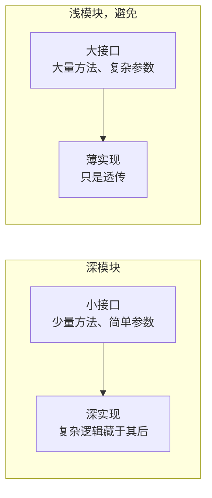

# 契约设计标准

to-spec 设计契约时使用的深模块词汇与判断标准。契约是接口的物化：trait、.proto、事件、.feature 都是接口，设计契约即设计接口

## 词汇表

精确使用这些词，不要用"组件""服务""API""边界"替代。用词一致是这套方法的核心

**模块**：任何有接口和实现的东西，恰好一个接口。刻意与规模无关：函数、类、包、跨层切片都可以。避免：单元、组件、服务

**接口**：调用方正确使用模块所需知道的一切：类型签名，以及不变式、顺序约束、错误模式、所需配置、性能特征。避免：API、签名

**实现**：模块内部的东西。与**适配器**区分：小适配器配大实现，比如 Postgres 仓储；大适配器配小实现，比如内存假件。讨论接缝时用"适配器"，其余用"实现"

**深度**：接口处的杠杆：调用方或测试每学习一单位接口能获得的行为量。大量行为藏在小接口后面是**深**，接口几乎和实现一样复杂是**浅**

**接缝**：不修改某处就能改变其行为的位置，即模块接口所在之处。接缝放哪里本身就是独立的设计决策，与接缝后面放什么不同。避免：边界，它与 DDD 的限界上下文重载

**适配器**：在接缝处满足接口的具体东西。描述的是**角色**，填补哪个槽位，不是**实质**，里面是什么

**端口**：接缝处定义的接口，由适配器实现。跨接缝依赖场景中用它指代接口

**杠杆**：调用方从深度得到的东西：每学习一单位接口获得更多能力

**局部性**：维护方从深度得到的东西：变更、缺陷、知识、验证集中在一处，而不是散布在调用方之间

## 深与浅

**深模块** = 小接口 + 大量实现，**浅模块** = 大接口 + 薄实现，避免：



设计接口时问自己：

- 能减少方法数量吗？
- 能简化参数吗？
- 能把更多复杂度藏进内部吗？

## 原则

- **深度是接口的属性，不是实现的属性**。深模块内部可以由小的、可 mock 的、可替换的部分组成，它们只是不在接口里。模块可以有**内部接缝**，实现私有、自己的测试用，以及**外部接缝**，即接口处
- **删除测试**。想象删除这个模块：如果复杂度消失了，它是透传；如果复杂度在 N 个调用方重现，它物有所值
- **接口就是测试面**。调用方和测试穿过同一个接缝。如果测试想绕过接口，模块形状多半不对
- **一个适配器是假设的接缝，两个适配器才是真实的**。除非确实有东西跨接缝变化，不要引入接缝

## 为可测试性设计

好的接口让测试自然：

- **接受依赖，不要创建依赖**

   ```rust
   // 可测试：依赖注入
   fn process_order(order: Order, gateway: &dyn PaymentGateway) -> Result<(), Error> {}

   // 难测试：内部创建依赖
   fn process_order(order: Order) -> Result<(), Error> {
       let gateway = StripeGateway::new();
   }
   ```

- **返回结果，不要制造副作用**

   ```rust
   // 可测试：返回结果
   fn calculate_discount(cart: &Cart) -> Discount {}

   // 难测试：制造副作用
   fn apply_discount(cart: &mut Cart) {
       cart.total -= discount;
   }
   ```

- **小表面积**：方法越少要写的测试越少，参数越少测试搭建越简单

## 跨接缝依赖

评估深化候选时对其依赖分类，类别决定深化后的模块如何跨接缝测试：

- **进程内**：纯计算、内存状态、无 I/O，总是可深化，直接通过新接口测试，不需要适配器
- **本地可替换**：有本地测试替身的依赖，如 Postgres 用 PGLite、文件系统用内存版。有替身就可深化，接缝是内部的，模块的外部接口没有端口
- **远程但自有**：自己控制的跨网络服务，如微服务、内部 API。在接缝处定义**端口**，深模块拥有逻辑，传输层作为**适配器**注入。测试用内存适配器，生产用 HTTP、gRPC 或队列适配器，逻辑即使跨网络部署也住在同一个深模块里
- **真外部**：Stripe、Twilio 等无法控制的第三方服务。深化后的模块把外部依赖作为注入的端口，测试提供 mock 适配器

## 拒绝的框架

- 把深度定义为实现行数对接口行数的比值：奖励注水实现。我们用的是深度即杠杆
- 把"接口"理解为 interface 关键字或类的公共方法：太窄，接口在这里包含调用方需要知道的每个事实
- 用"边界"代替：它与 DDD 的限界上下文重载。说**接缝**或**接口**
