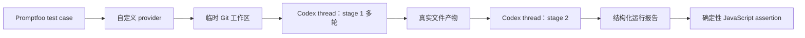

# 中文 SKILL 评测框架

这是一个独立的 Promptfoo 项目，用“评测驱动迭代”打磨 `../my_skills`。这里的“训练”
不是修改模型权重：Promptfoo 负责运行场景、评分和比较；后续迭代修改的是 SKILL 文本、
引用资料或脚本。

框架目前支持：

- 中文单轮与多轮对话；
- 同一线程连续追问；
- 新线程复用同一隔离工作区；
- 关联 SKILL 的真实文件交接；
- Golden Fixture（固定前置文件）；
- baseline、candidate 和 no-skill 控制组；
- 响应、SKILL 读取、命令、文件差异和文件内容的确定性评分；
- 每个 case 独立的临时 Git 仓库，以及无模型 smoke 测试。

## 执行模式



这里不使用协作 Subagent 充当被测对象。每个 `case × variant` 都由 Codex SDK 创建独立
thread；一个 stage 内反复调用同一个 `thread.run()`，所以保留对话上下文。stage 标为
`thread: new` 时会创建新 thread，但 `workingDirectory` 不变，因此新 thread 只能通过
上游真实写下的文件获得上下文。

这个实现遵循 [Codex SDK 文档](https://developers.openai.com/codex/sdk/)关于重复调用
`thread.run()` 延续同一 thread 的方式。Promptfoo 部分使用其
[JavaScript provider](https://www.promptfoo.dev/docs/providers/custom-api/) 和
[JavaScript assertion](https://www.promptfoo.dev/docs/configuration/expected-outputs/javascript/)
扩展点。

## 快速开始

要求 Node.js 22.22 或更高版本。依赖已锁定在 `bun.lock`。

```bash
cd skill-evals
bun install
npm test
npm run validate
npm run smoke
```

`validate` 还会校验场景 DSL、fixture、目标 SKILL、重复场景 ID 和 baseline 内容哈希。
`smoke` 不调用模型，它验证 Promptfoo、自定义 provider、报告解析和评分链路是否连通。

运行真实模型：

```bash
# 单轮、会产生模型用量的 SDK 连通检查
npm run smoke:codex

# 只评当前 my_skills，适合日常迭代
npm run eval:candidate

# baseline 与 candidate 跑完全相同的场景
npm run eval:compare
npm run report:compare

# CI/正式验收门：candidate 必须全通过，且不能低于 baseline
npm run gate:compare

# 移除每个场景 targetSkills 中列出的 SKILL，检查触发是否真有增益
npm run eval:control

# 用户填充并冻结 tests/acceptance.yaml 后运行
npm run eval:acceptance
npm run gate:acceptance
```

控制组仍检查响应和文件行为，但会跳过“必须读取已被移除的目标 SKILL”这一项，否则控制
组会因为测试装置本身而必然失败。

默认模型是 `gpt-5.6-sol`，reasoning effort 是 `medium`。可通过环境变量覆盖：

```bash
CODEX_EVAL_MODEL=gpt-5.6-sol CODEX_EVAL_REASONING=medium npm run eval:candidate
```

SDK 会使用现有 Codex 登录，或读取 `OPENAI_API_KEY`。运行器不把密钥写入结果。真实评测
默认关闭网络、关闭 Web Search、拒绝提权，并且只允许场景选择 `read-only` 或
`workspace-write`。

## 目录

```text
skill-evals/
├── assertions/                 # Promptfoo 确定性评分入口
├── fixtures/
│   ├── reports/                # 无模型 smoke 报告
│   └── workspaces/             # Golden Fixture
├── lib/                        # 场景、工作区、Codex 和评分核心
├── providers/                  # Promptfoo 自定义 provider
├── scenarios/development/      # 可见开发场景
├── tests/
│   ├── development.yaml        # 日常迭代清单
│   ├── acceptance.yaml         # 用户验收时冻结的清单
│   └── unit/                   # 框架自身测试
├── variants/baseline/          # 已冻结的初始 SKILL 快照
└── results/                    # 评测输出，已忽略
```

case 工作区默认位于系统临时目录的 `keel-skill-eval-workspaces/`，刻意放在源代码仓库
之外，避免继承主项目的 `AGENTS.md`。可用 `SKILL_EVAL_WORKSPACES_ROOT` 指定另一个绝对
路径，但同样应放在被测仓库之外。

完整场景 DSL 见 [docs/scenario-schema.md](docs/scenario-schema.md)，人员分工与验收时点见
[docs/acceptance-workflow.md](docs/acceptance-workflow.md)。

## 多轮和文件交接

`scenarios/development/grilling-multi-turn.yaml` 在一个 thread 中连续运行四轮，逐轮检查
“一次一个问题”，并检查确认前没有执行计划。它不强制整段响应以问号结尾，因为 SKILL
要求在问题后附推荐答案。这里使用 `workspace-write` 是有意的：
若用 `read-only`，沙箱会替 SKILL 阻止写入，反而无法观察它是否想抢跑。

`scenarios/development/grill-with-docs-handoff.yaml` 采用两阶段：

1. 上游 thread 运行 `grill-with-docs`，允许 `domain-modeling` 写 `context.md`；
2. 下游新 thread 复用工作区，只根据实际 `context.md` 回答。

因此，“grilling 不执行被讨论的计划”与“domain-modeling 同步领域文件”没有被写成全局
冲突。文件权限按场景定义：纯 grilling 场景要求文件不变，组合场景明确允许并要求领域
文件变化。

Golden Fixture 用于另一类问题：

- 想单独定位下游 SKILL 是否正确消费既有文件；
- 上游输出波动会掩盖下游回归；
- 需要稳定复现边缘状态。

最佳组合是：关联链路至少有一条真实交接集成测试，同时为重要消费者补 Golden Fixture
单元场景。不要把所有上游输出都 mock，也不要让每个下游测试都依赖昂贵且不稳定的上游。

## baseline 的规则

`variants/baseline` 已保存搭框架时的 5 个 SKILL。评测不会自动刷新它，否则 candidate
退化时 baseline 也会一起移动。

只有在一轮改进已经被接受、准备开启下一轮时才执行：

```bash
npm run baseline:snapshot -- --force
```

执行前应先审阅 candidate 结果；`--force` 会原子替换基线，并把上一版保留在已忽略的
`variants/baseline-backups/` 中。manifest 记录技能清单和内容哈希。

## 结果与重复运行

JSON 结果写入 `results/`。模型输出有随机性，正式比较建议至少重复三次：

```bash
npm run eval:compare -- --repeat 3
npm run report:compare
```

确定性 assertion 对每个原子条件给 0 或 1，全部满足才 PASS；总分是原子条件平均值。
重复运行用于估计通过率，不应用一次偶然 PASS 代替稳定性判断。

Promptfoo 是评测编排器，不会自动判断业务标准是否正确。初始场景和评分由框架搭建者提供
草案；业务含义、失败代价和最终验收标准必须由 SKILL 所有者在开始优化前确认。
